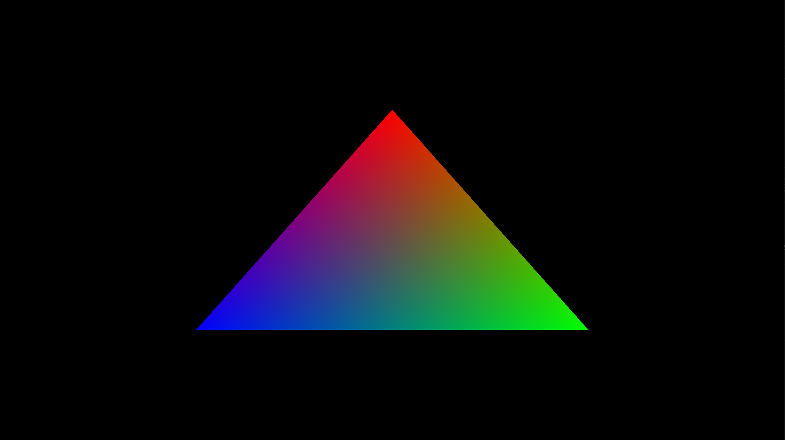

# Vulkan Engine
It's a side project that practices to use Vulkan to do the render stuff.
## Outline
* [Precondition](#Precondition)
* [Build](#Build)
* [Practice](#Practice)
## Precondition
* CMake
* Vulkan
* GLFW
* GLM

## Build
1. Setup Enviornment variable in CMakeEnv/xxx.cmake

Example
```CMake
set(VULKAN_SDK_PATH C:/VulkanSDK/1.3.236.0)
set(GLFW_PATH D:/ExternalLibrary/glfw-3.3.8.bin.WIN64)
set(GLM_PATH D:/ExternalLibrary/glm-0.9.9.8/glm)
```

2. Build using cmake

```CMD
cd build
cmake -S ../ -B ./
make clean
make
make Shaders
```

## Practice
No | Practice Content | Link | Picture
---|---|---|---
02 | Use Vertex + Index Buffer to draw Quad | [Link](https://github.com/Darkgrouptw/VulkanEngine/tree/Practice-00) | 
01 | Triangle | [Link](https://github.com/Darkgrouptw/VulkanEngine/tree/Practice-01) | 
00 | Open GLFW window that use Vulkan | [Link](https://github.com/Darkgrouptw/VulkanEngine/tree/Practice-00) | 